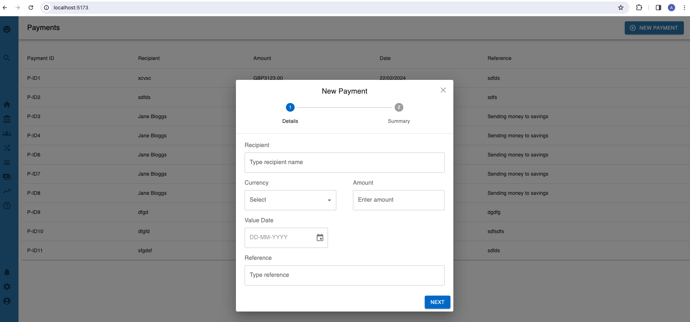

# Alpha Group Technical Assessment

## Candidate Name: Anwin Robin
My solution to the Alpha Group assessment consists of a React frontend, Typescript/Node/Express API server and PostgreSQL database. These have been containerised to run with docker-compose and I will outline how in the instructions below. 

## Local Set Up Instructions
- Pull / download repo
- Open terminal and change to the project directory 
- We must now create the images for the React app and API server
- Assuming Docker is already installed, navigate to /frontend directory
- Run the following command to build the image for the react app from the Dockerfile
```bash
docker build -t react-app .
```
- Similarly for the API server, navigate to the /backend directory and run this command to build its image
```bash
docker build -t api-server .
```

We run the application using docker-compose with this command
```bash
docker-compose up -d
```

Finally to access the application, navigate to http://localhost:5173/

Please note that the api/database container can take a little time to initialise the first time you run docker-compose, so you may see an ERR_CONNECTION_REFUSED in the console if you open the application and try to create a payment immediately. Please wait a few minutes and try again if this is the case. 

## Using the Application
There will be no payments in the database when first running the app so click the new payment button to create a new one. 



Fill in the form in the modal with the chosen details and review to see it's all ok.

Finally after clicking complete, if the payment is created successfully a green success alert should appear and the new payment row will be added to the main table.

### Endpoints
The client side will make GET and POST requests to the /payments endpoint to get and create payments.

Additionally there are a couple of endpoints which can be called with a direct request to the server (http://localhost:3000/)
- payments/:id - returns one payment of a chosen id
- /filteredPayments - nice to have requirement, returns list of payments based on metadata sent with the request
    - done by providing query string parameters
    - e.g. /filteredPayments?currency=GBP will return all payments that have GBP as the currency

### Running tests
Unit tests have been written with Jest and can be found in the backend/\__tests__ folder. To run first install node packages with npm i and then use this command
```bash
npm run test
```

## Data model:
- No fields in payment data should be blank or null
- recipient, name - set to standard varchar of length 255
- date - also a varchar but with some checking of format in backend
- amount - decimal with max digit of 10 and 2 d.p.
- currency - will be one of 5 random currency codes for now


## Ideas for Improvements
- Search and filter functionality in the UI
- Pagination for table
- More testcases, with acceptance tests and react tests
- Storing date as date object
